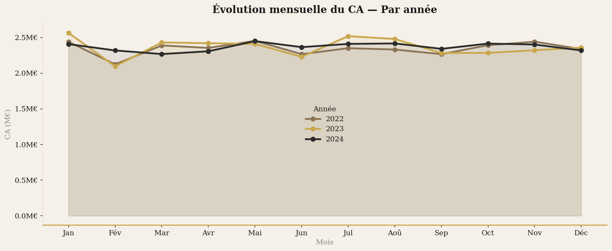
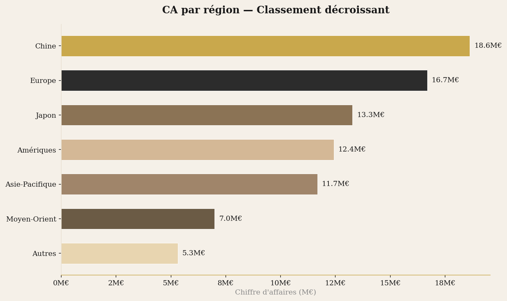
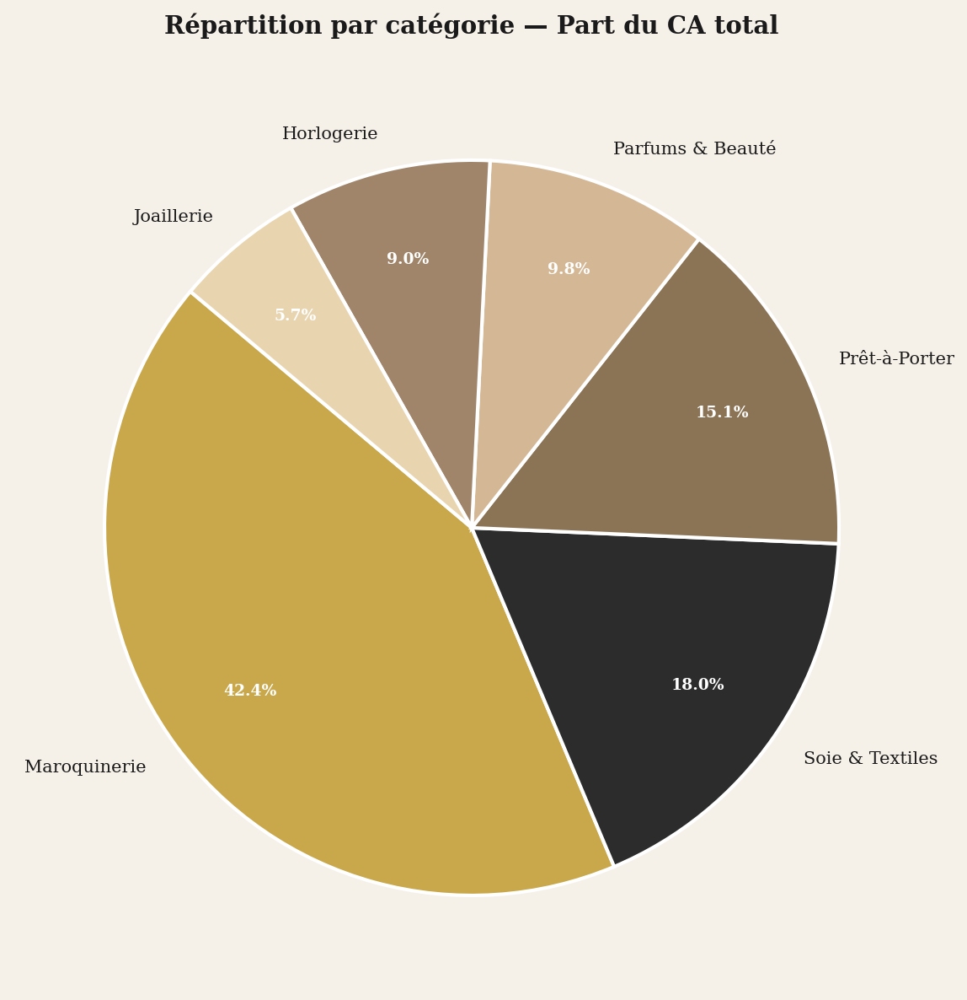
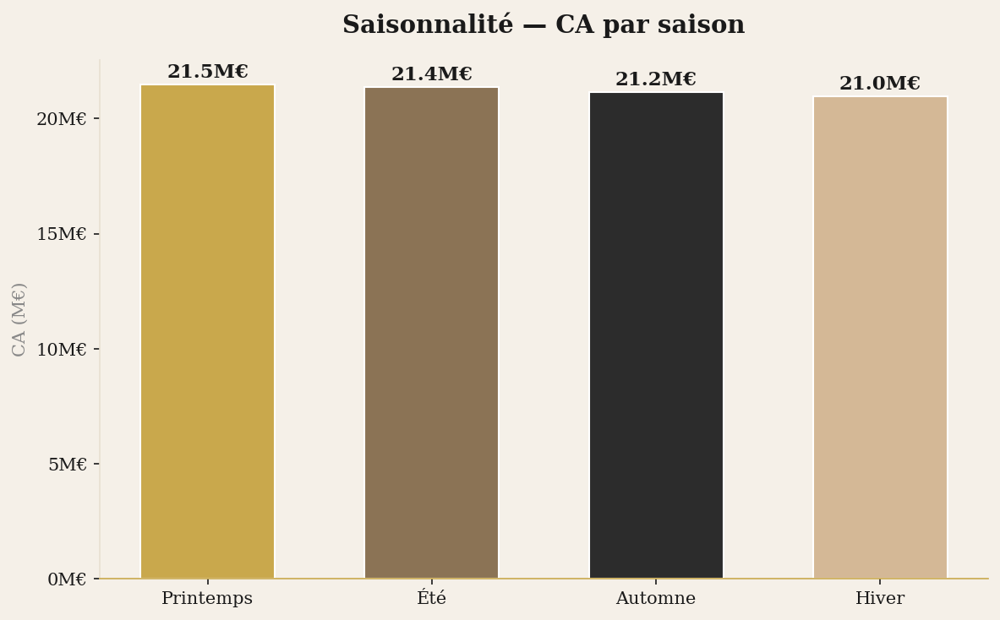
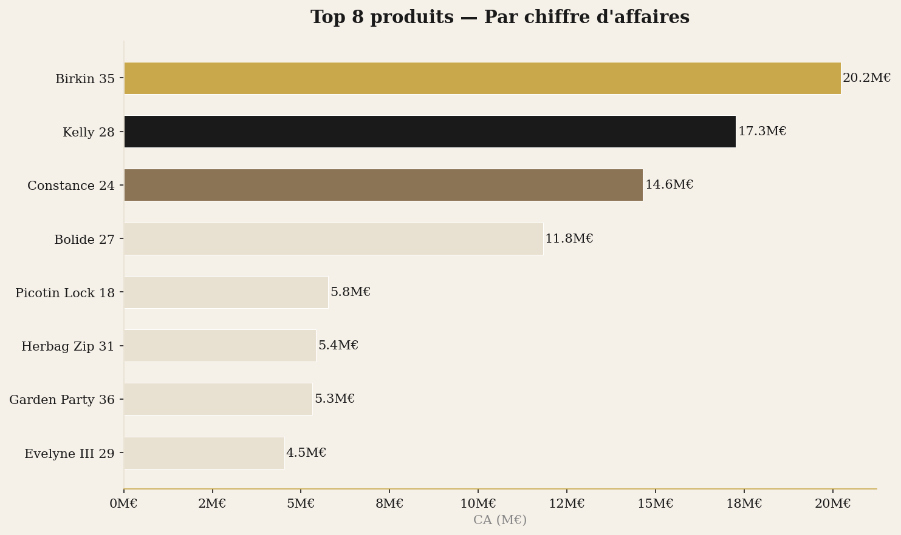
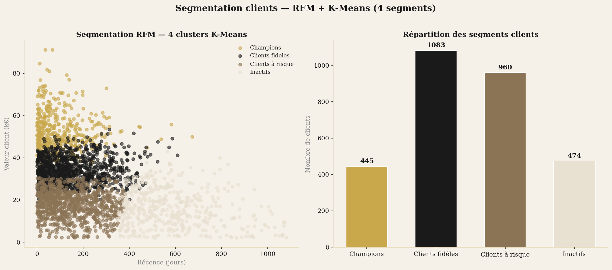

#  Hermès Sales Performance Analysis 2022–2024

> Analyse complète des ventes d'une Maison de luxe sur données simulées — EDA, performance commerciale et segmentation clients RFM + K-Means.

**⚠️ Les données utilisées dans ce projet sont entièrement simulées à des fins analytiques. Ce projet n'est pas affilié à Hermès International.**

---

## 📊 Aperçu

| Métrique | Valeur |
|---|---|
| CA total simulé | 85M€ |
| Panier moyen | 5 663€ |
| Clients actifs | 2 982 |
| Période | 2022 – 2024 |
| Top région | Chine (18.9M€) |
| Segments clients | 4 (RFM + K-Means) |

---

## 🎯 Objectifs

- Analyser la performance commerciale d'une Maison de luxe sur 3 ans
- Identifier les dynamiques de vente par région, catégorie et saison
- Segmenter les clients en profils actionnables via RFM et K-Means
- Produire des visualisations prêtes à l'emploi pour des équipes métiers

---

## 🛠️ Stack technique


---

## 📁 Structure du projet

```
hermes-sales-analysis/
├── hermes_analysis.py      # Script principal d'analyse
├── data/
│   └── hermes_sales.csv    # Dataset simulé (15 000 transactions)
├── images/
│   ├── 01_ca_mensuel.png
│   ├── 02_ca_region.png
│   ├── 03_categories.png
│   ├── 04_saisonnalite.png
│   ├── 05_top_produits.png
│   └── 06_rfm_kmeans.png
└── README.md
```

---

## 📈 Visualisations

### 1. Évolution mensuelle du CA par année


### 2. CA par région


### 3. Répartition par catégorie


### 4. Saisonnalité


### 5. Top 8 produits


### 6. Segmentation clients RFM + K-Means


---

## 🔍 Insights clés

- **Chine** représente le premier marché avec 18.9M€ (22% du CA total)
- **Maroquinerie** domine avec 42% du CA — cohérent avec le positionnement Hermès
- **L'automne** est la saison la plus performante (28% du CA)
- **4 segments clients** identifiés : Champions, Clients fidèles, Clients à risque, Inactifs
- Le **panier moyen** de 5 663€ reflète le positionnement ultra-premium de la Maison

---

## 🚀 Lancer le projet

```bash
# Cloner le repo
git clone https://github.com/timaaagour/hermes-sales-analysis.git
cd hermes-sales-analysis

# Installer les dépendances
pip install pandas numpy matplotlib scikit-learn plotly dash

# Lancer l'analyse
python hermes_analysis.py
```

---

## 👩‍💻 Auteure

**Fatima Aagour** — Data Analyst · Paris  
[Portfolio](https://timaaagour.github.io) · [LinkedIn](https://www.linkedin.com/in/fatima-zahra-aagour/) · aagour.fati@gmail.com
